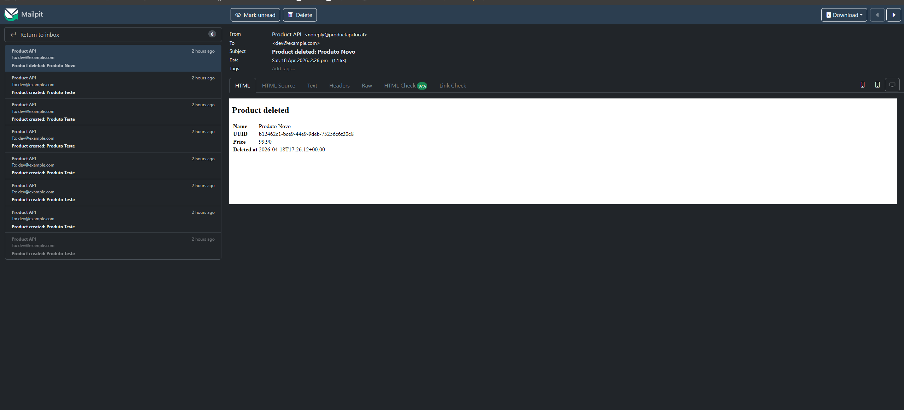
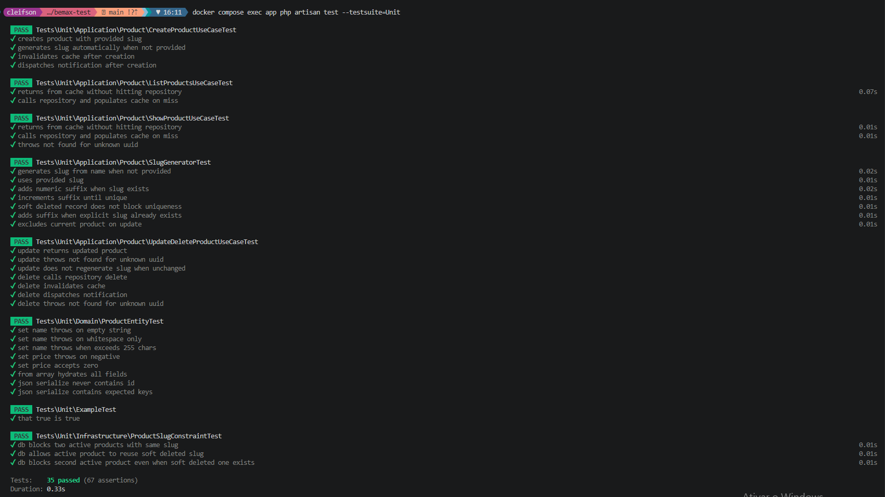
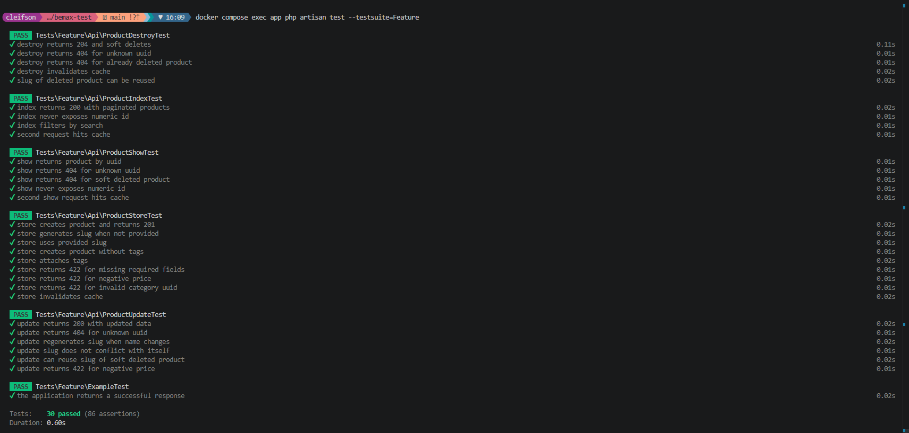

# API de Gerenciamento de Produtos

API RESTful para gerenciamento de produtos construída com Laravel 13, seguindo princípios de Domain-Driven Design e containerizada com Docker.

---

## Stack

| Camada | Tecnologia |
|---|---|
| Runtime | PHP 8.4 / Laravel 13 |
| Servidor web | Nginx 1.25 |
| Banco de dados | MySQL 8.0 |
| Cache | Redis 7 |
| Worker de filas | Redis (container dedicado) |
| E-mail (dev) | Mailpit |

---

## Setup

### Pré-requisitos

- Docker + Docker Compose

### 1. Clone e entre no projeto

```bash
git clone https://github.com/Cleyfson/bemax-test
cd bemax-test
```

### 2. Copie o arquivo de ambiente

```bash
cp api/.env.example api/.env
```

### 3. Suba os containers

```bash
docker compose up -d --build
```

Isso inicia seis containers: `bemax_app`, `bemax_nginx`, `bemax_mysql`, `bemax_redis`, `bemax_mailpit` e `bemax_queue`.

### 4. Gere a chave da aplicação

```bash
docker compose exec app php artisan key:generate
```

### 5. Execute as migrations e o seed

```bash
docker compose exec app php artisan migrate
docker compose exec app php artisan db:seed
```

O seeder cria categorias, tags e 15 produtos com associações aleatórias.

### 6. Verifique

```
GET http://localhost:8080/api/products
```

---

## Documentação interativa

A coleção com os endpoints, exemplos de body está disponível no Postman:

[](https://app.getpostman.com/run-collection/26530639-af161861-6e78-41ab-b9c4-5d5ad6fb62cd?action=collection%2Ffork&source=rip_markdown&collection-url=entityId%3D26530639-af161861-6e78-41ab-b9c4-5d5ad6fb62cd%26entityType%3Dcollection%26workspaceId%3D4de0c969-c218-471e-bf2b-0cdd9b6fa94c)

---

## Endpoints

Todas as respostas são encapsuladas em `{"data": ...}`. IDs numéricos nunca aparecem em respostas, URLs ou erros de validação, apenas UUIDs são expostos.

### `GET /api/products`

Lista produtos com paginação e busca opcional.

**Parâmetros de query:**

| Parâmetro | Tipo | Descrição |
|---|---|---|
| `page` | integer | Número da página (padrão: 1) |
| `per_page` | integer | Itens por página (padrão: 15) |
| `search` | string | Filtra por nome ou slug (opcional) |

**Resposta `200`:**
```json
{
  "data": [
    {
      "uuid": "018e...",
      "name": "Produto Exemplo",
      "slug": "produto-exemplo",
      "price": 29.99,
      "description": "...",
      "category": { "uuid": "...", "name": "Eletrônicos" },
      "tags": [{ "uuid": "...", "name": "promoção" }],
      "created_at": "2026-04-17T10:00:00.000000Z",
      "updated_at": "2026-04-17T10:00:00.000000Z"
    }
  ],
  "meta": { "current_page": 1, "last_page": 3, "per_page": 15, "total": 42 }
}
```

---

### `POST /api/products`

Cria um novo produto.

**Body (JSON):**

| Campo | Tipo | Obrigatório | Observações |
|---|---|---|---|
| `name` | string | sim | máx. 255 caracteres |
| `slug` | string | não | gerado automaticamente a partir do `name` se omitido; sufixo adicionado se já existir |
| `price` | number | sim | deve ser ≥ 0 |
| `description` | string | não | |
| `category_uuid` | string | sim | deve existir em `categories` |
| `tag_uuids` | array de strings | não | cada item deve existir em `tags` |

**Resposta `201`:** objeto produto (mesmo formato acima).

**Resposta `422`:** erros de validação (apenas nomes de campos e UUIDs, nunca IDs numéricos).

---

### `GET /api/products/{uuid}`

Retorna um único produto pelo UUID.

**Resposta `200`:** objeto produto.  
**Resposta `404`:** produto não encontrado ou soft-deletado.

---

### `PATCH /api/products/{uuid}`

Atualiza parcialmente um produto. Todos os campos são opcionais (`sometimes`).

**Body (JSON):** mesmos campos do `POST`, todos opcionais.

**Unicidade do slug na atualização:** a validação ignora o próprio slug do produto atual e ignora registros soft-deletados, portanto um slug anteriormente usado por um produto deletado pode ser reutilizado livremente.

**Resposta `200`:** objeto produto atualizado.  
**Resposta `404` / `422`:** não encontrado ou erro de validação.

---

### `DELETE /api/products/{uuid}`

Soft-deleta um produto. O registro permanece no banco com `deleted_at` preenchido; seu slug fica livre para reutilização.

**Resposta `204`:** sem conteúdo.  
**Resposta `404`:** produto não encontrado.

---

## Geração de slug

- Se nenhum `slug` for fornecido na criação, um é gerado a partir do `name` usando `Str::slug()`.
- Se o slug candidato já existir entre os produtos **ativos**, um sufixo numérico é adicionado: `meu-produto`, `meu-produto-1`, `meu-produto-2`, …
- Produtos soft-deletados **não** bloqueiam a reutilização do slug nem na camada de aplicação (`EloquentSlugGenerator` consulta sem `withTrashed`) nem na camada de banco de dados (um índice único funcional `IF(deleted_at IS NULL, slug, NULL)` ignora registros deletados).

---

## Cache

**Driver:** Redis (configurado via `CACHE_STORE=redis` no `.env`).

**O que é cacheado:**

| Endpoint | Chave de cache | Tag |
|---|---|---|
| `GET /api/products` | `page:perPage:md5(search)` | `products_list` |
| `GET /api/products/{uuid}` | `{uuid}` | `products_show` |

**TTL:** controlado por `CACHE_TTL` no `.env` (padrão: 3600 segundos).

**Estratégia de invalidação (via `Cache::tags()`):**

| Operação | Efeito |
|---|---|
| `POST` (criação) | limpa `products_list` |
| `PATCH` (atualização) | remove a entrada específica do UUID em `products_show`, limpa `products_list` |
| `DELETE` (soft delete) | remove a entrada específica do UUID em `products_show`, limpa `products_list` |

`Cache::tags()` agrupa entradas relacionadas do cache para que todo o cache de listagem (todas as páginas, todas as variantes de busca) possa ser invalidado em uma única chamada, sem varrer as chaves do Redis.

---

## Filas e notificações

Quando um produto é **criado** ou **soft-deletado**, uma notificação por e-mail é disparada de forma assíncrona.

**Driver:** Redis (`QUEUE_CONNECTION=redis`).

**Fluxo:**

1. O use case chama `ProductNotifierInterface::notifyCreated()` / `notifyDeleted()`.
2. `LaravelProductNotifier` despacha um job (`SendProductCreatedNotificationJob` ou `SendProductDeletedNotificationJob`) para a fila Redis.
3. O container dedicado `bemax_queue` executa `php artisan queue:work redis --tries=3 --timeout=30` e processa o job.
4. O job envia um `Mailable` para o endereço definido em `NOTIFICATION_EMAIL` (`.env`).

Os e-mails são interceptados pelo Mailpit e ficam visíveis em `http://localhost:8025`.



---

## Rodando os testes

### Rodar a suite completa

```bash
docker compose exec app php artisan test
```

### Rodar um grupo específico

```bash
# Somente testes unitários
docker compose exec app php artisan test --testsuite=Unit

# Somente testes de feature
docker compose exec app php artisan test --testsuite=Feature

# Uma classe específica
docker compose exec app php artisan test --filter=ProductStoreTest
```

**Cobertura por suite:**

| Suite | O que é testado |
|---|---|
| `Unit/Domain` | Validações e regras de fábrica da `ProductEntity` |
| `Unit/Application` | Lógica dos use cases (geração de slug, leitura/escrita/invalidação de cache, notificações) com dependências mockadas |
| `Unit/Infrastructure` | Constraint de slug no banco de dados (índice único funcional) contornando a camada de aplicação |
| `Feature/Api` | Ciclo completo requisição HTTP → resposta para os cinco endpoints, incluindo casos extremos de slug, comportamento de soft delete e paginação |

**Testes Unitários** | **Testes de Feature**
:---:|:---:
 | 

---

## Arquitetura

O projeto segue uma estrutura em camadas inspirada em DDD onde as **dependências sempre apontam para dentro**: camadas externas dependem das internas, nunca o contrário.

```
Http  ──▶  Application  ◀──  Infra
                │
                ▼
             Domain
```

---

### Domain

A camada mais interna. Contém classes PHP puras com **zero dependência de framework**, nenhum `use Illuminate\...` aqui.

| Classe | Responsabilidade |
|---|---|
| `ProductEntity`, `CategoryEntity`, `TagEntity` | Encapsulam dados de negócio e aplicam invariantes (ex: preço não pode ser negativo) |
| `ProductNotFoundException` | Exceção de domínio, lançada quando um produto não é encontrado |
| `ProductRepositoryInterface`, `CategoryRepositoryInterface`, `TagRepositoryInterface` | Contratos de acesso a dados — definidos aqui, implementados na Infra |

O domínio pode ser testado com `PHPUnit\Framework\TestCase` puro, sem bootstrap do Laravel.

---

### Application

Orquestra objetos de domínio para cumprir os casos de uso. É aqui que as **regras de negócio são centralizadas**. Depende apenas do Domain e das interfaces, sem acoplamento direto a banco de dados, cache ou serviços externos.

| Classe | Responsabilidade |
|---|---|
| `CreateProductUseCase` | Gera slug, persiste via repositório, despacha notificação de criação, invalida cache de listagem |
| `ListProductsUseCase` | Lê do cache; em caso de miss, consulta o repositório e escreve no cache |
| `ShowProductUseCase` | Lê do cache; em caso de miss, consulta o repositório e escreve no cache |
| `UpdateProductUseCase` | Persiste alterações via repositório, invalida cache de show + listagem |
| `DeleteProductUseCase` | Soft-deleta via repositório, despacha notificação de deleção, invalida cache de show + listagem |
| `ProductCacheInterface` | Contrato para leitura/escrita/invalidação de cache |
| `SlugGeneratorInterface` | Contrato para geração de slug |
| `ProductNotifierInterface` | Contrato para notificações assíncronas |

---

### Infra

Implementações concretas das interfaces definidas no Domain e Application. É aqui que vivem as integrações com Eloquent, Redis e Mail, detalhes de infraestrutura que as camadas internas não precisam conhecer.

| Classe | Implementa | Observações |
|---|---|---|
| `EloquentProductRepository` | `ProductRepositoryInterface` | Consultas Eloquent; mapeia models para entidades de domínio |
| `EloquentSlugGenerator` | `SlugGeneratorInterface` | Consulta a tabela `products` sem `withTrashed` — registros soft-deletados não bloqueiam unicidade |
| `RedisProductCache` | `ProductCacheInterface` | `Cache::tags()` para invalidação agrupada |
| `LaravelProductNotifier` | `ProductNotifierInterface` | Despacha `SendProductCreatedNotificationJob` / `SendProductDeletedNotificationJob` para a fila Redis |

---

### Http

A camada mais externa. Controllers recebem requisições HTTP, delegam inteiramente para os use cases e retornam respostas. **Nenhuma lógica de negócio vive aqui.**

Controllers são intencionalmente simples: resolvem a requisição em parâmetros tipados e os passam para o use case. O tratamento de erros é feito globalmente em `bootstrap/app.php`, exceções de domínio são mapeadas para respostas HTTP lá, não nos controllers.

---

### Inversão de dependência na prática

Todos os bindings de interface para implementação são registrados no `AppServiceProvider`:

```php
$this->app->bind(ProductRepositoryInterface::class,  EloquentProductRepository::class);
$this->app->bind(SlugGeneratorInterface::class,       EloquentSlugGenerator::class);
$this->app->bind(ProductCacheInterface::class,        RedisProductCache::class);
$this->app->bind(ProductNotifierInterface::class,     LaravelProductNotifier::class);
// ...
```

Isso significa que os use cases recebem interfaces via injeção de dependência no construtor. Nos testes unitários, essas interfaces são substituídas por mocks, a lógica do use case é testada em completo isolamento de Eloquent, Redis e Mail.

---